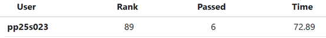
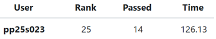
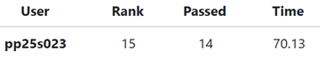
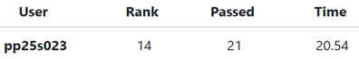
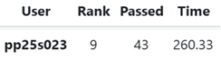
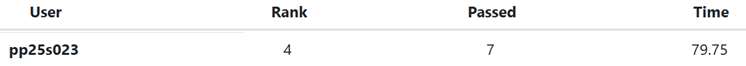
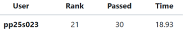

# NTHU 2025 Fall – CS542200 Parallel Programming

This repository contains the **homework assignments and labs** for the *Parallel Programming* course at **National Tsing Hua University (NTHU)**, Fall 2025.

## 📌 Homework 1: [Odd–Even Sort](./hw1/PP_2025_HW1.pdf)

Implementation of the **Odd–Even Sort** algorithm using **MPI**.

*Performance Rank:*

## 📌 Homework 2: [Mandelbrot Set](./hw2/PP_2025_HW2.pdf)

Parallelization of the **Mandelbrot Set** computation using thread programming:

- **Pthread** ([`hw2a`](./hw2/hw2a.cc))
- **OpenMP** ([`hw2b`](./hw2/hw2b.cc))

*Performance Rank:*
- **hw2a**  
  

- **hw2b**  
  

## 📌 Homework 3: [All-Pairs Shortest Path](./hw3/PP_2025_HW3.pdf)

Solving the **All-Pairs Shortest Path (APSP)** problem with the **Blocked Floyd–Warshall** algorithm:

- CPU parallelization using **OpenMP** ([`hw3-1`](./hw3/hw3-1.cc))
- Single-GPU acceleration using **CUDA & HIP** ([`hw3-2`](./hw3/hw3-2.cu))
- Multi-GPU acceleration using **CUDA & HIP** ([`hw3-3`](./hw3/hw3-3.cu))

*Performance Rank:*
- **hw3-1**  

- **hw3-2**  

- **hw3-3**  

  

## 📌 Homework 4: [Flash Attention](./hw4/PP_2025_HW4.pdf)

Implementation of the forward pass of **FlashAttention** using **CUDA & HIP**.

*Performance Rank:*

